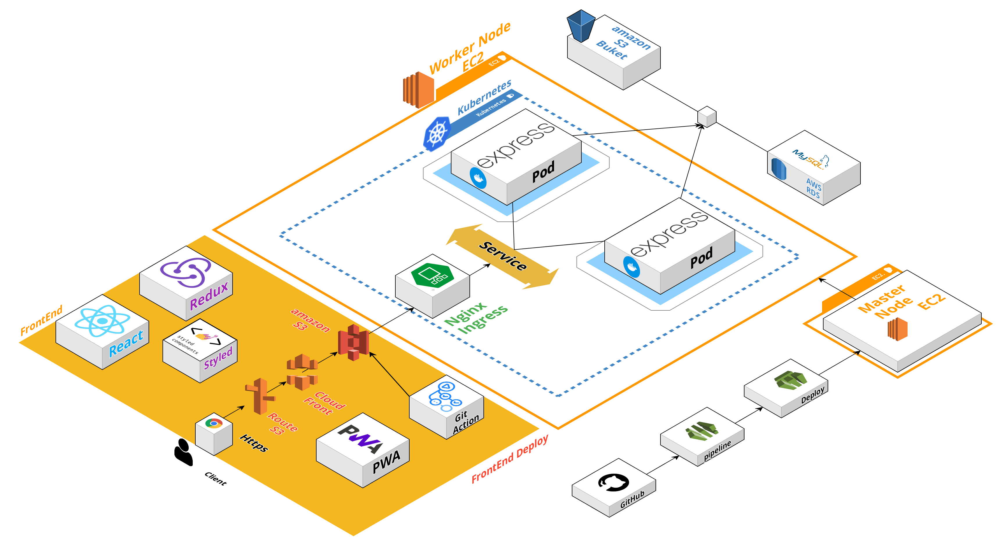
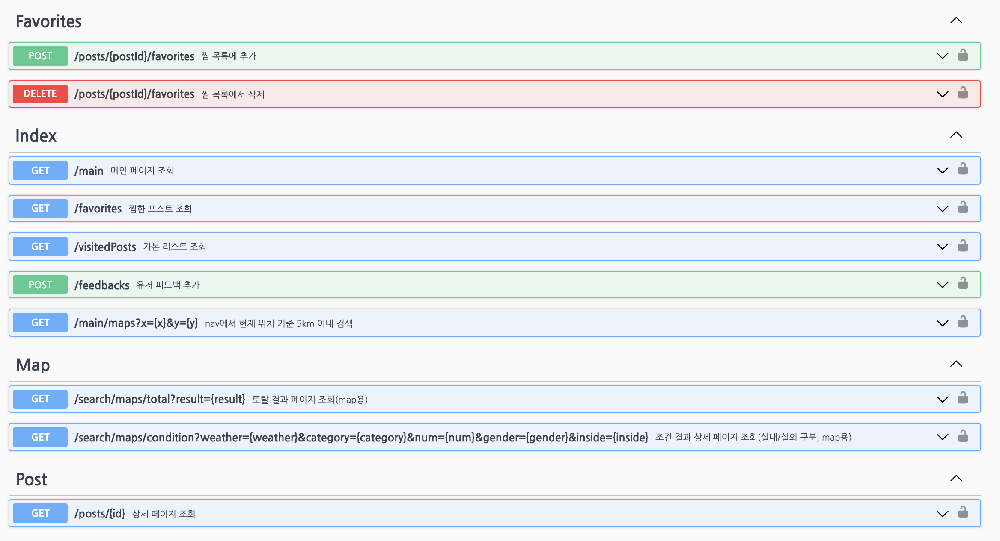
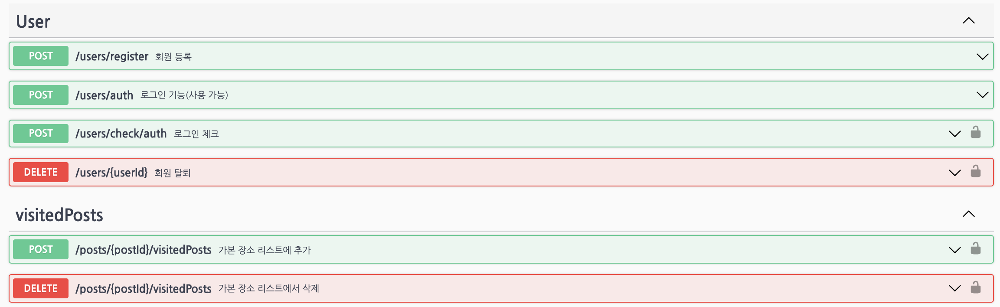
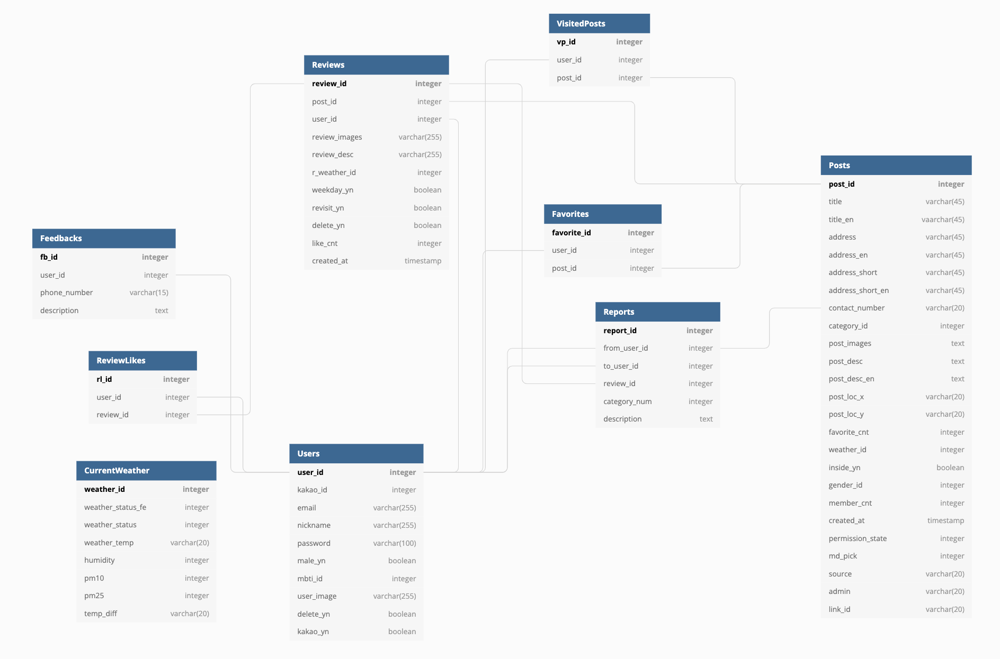
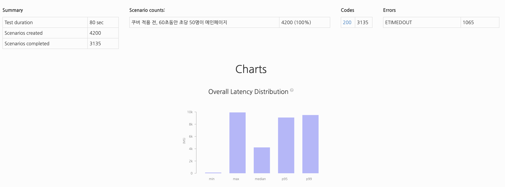
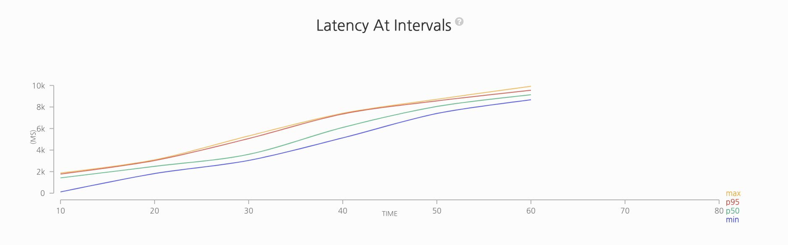
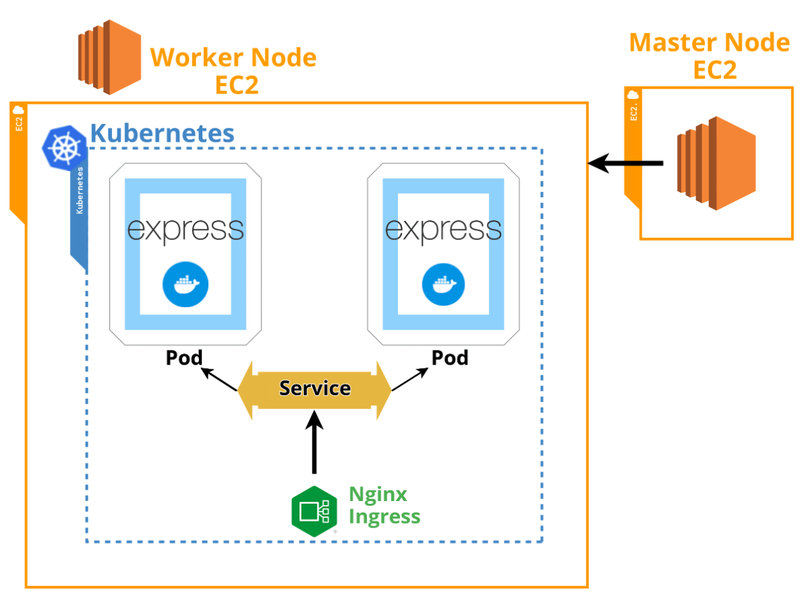
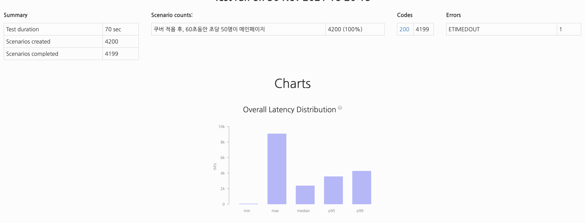

# 🌈 InSplace-BE

## ✍🏻 서비스 소개

InSplace는 In Seoul Place의 약자로,
내/외국인에게 당장 오늘 뭐 할지, 어디 갈지에 대한 고민을 현재 위치와 날씨를 기반으로 장소를 추천해주는 서비스입니다.

## ⛅️ 팀원 소개

- **Back End**
  - 나종완(팀장)([https://github.com/jongwanra](https://github.com/jongwanra))
  - 이병관([https://github.com/fnrkp089](https://github.com/fnrkp089))
  - 김기태([https://github.com/TAE6919](https://github.com/TAE6919))
- **Front End**
  - 양진성([https://github.com/jinseoIT](https://github.com/jinseoIT))
  - 이미다([https://github.com/dam-lee](https://github.com/dam-lee))
  - 고규식([https://github.com/kokyusik91](https://github.com/kokyusik91))
- **Designer**
  - 이미주()
  - 이경미([https://github.com/leekyungmimiii](https://github.com/leekyungmimiii))

## ❄️ Project Architecture

## 🛠 Tech Stack

- Express.js
- MySQL
- Nginx Ingress
- Code Pipeline
- Code Deploy
- Swagger
- Docker
- Kubernetes
- EC2
- S3
- RDS

## 🌧 Library

|       library       |                         description                         |
| :-----------------: | :---------------------------------------------------------: |
|       dotenv        |            보안적으로 문제가 있는 데이터 숨기기             |
|        cors         |            CORS보안 정책을 해결하기 위하여 사용.            |
|       bcrypt        |         해시함수를 사용하여 암호화 하기 위해 사용.          |
|         joi         |                    Validate를 위해 사용.                    |
|   @slack/webhook    |                slack 채팅을 하기 위해 사용.                 |
|     compression     |                페이지를 압축하기 위해 사용.                 |
|       express       |       빠르고 개방적인 개발을 위해 웹 프레임워크 사용.       |
|    jsonwebtoken     |                    JWT Token 위해 사용.                     |
|  morgan, wingston   |                에러 로그 관리하기 위해 사용.                |
|       mysql2        |           Node.js에서 MySQL을 사용하기 위해 사용.           |
|      artillery      |             서버 부하테스트 하기 위해 사용한다.             |
|       multer        |                         파일 업로드                         |
|      multer-s3      |                      S3에 파일 업로드                       |
| multer-s3-transform |           upload시 자동으로 파일을 변형시켜준다.            |
|    swagger-jsdoc    | 주석에 Swagger 태그를 추가하여 API를 문서화 하기 위해 사용. |
| swagger-ui-express  |            API 문서를 UI 렌더링 하기 위해 사용.             |
|       helmet        |            서버 어플리케이션의 보안을 위해 사용             |

## 🔎 API

[Notion API Address](https://humble-impulse-a58.notion.site/API-ea80617bb56e4488807877a15ad2a3c2)

## 📋 ERD

## ✅ 부하 테스트

- **쿠버네티스 적용 전**

  - 아키텍쳐

- 부하 테스트 결과

  
  

- **쿠버네티스 적용 후**

  - 아키텍쳐

    

  - 부하 테스트 결과
    
    

- **이전 이미지로딩 vs 썸네일 적용후**

  - 이전 이미지 로딩

    

  - 썸네일

    

  - 썸네일 적용 전 후 응답 속도 차이

    

    Slow 3G 환경에서 약 2배 정도 속도개선이 되었다는 것을 알 수 있고 InSplace는 이미지가 주된 서비스이므로 2배 이상의 효과를 나타낼 것으로 기대하고 있습니다.

## ✅ 향후 프로젝트의 목표

- **에러 로그 관리**

  - 현재 백엔드 에러 로그 관리
    

  - 적용 시킬 에러 로그 관리(키바나)
    
  - 기존 로그 관리법과 ELK의 차이점.
    - 키바나를 사용하면 파일로 로그 관리하는 것 보다 직관적이다.
    - Elastic Search 사용하면 파일로 로그 관리하는 것 보다 해당하는 에러를 찾기가 더 쉽다.
