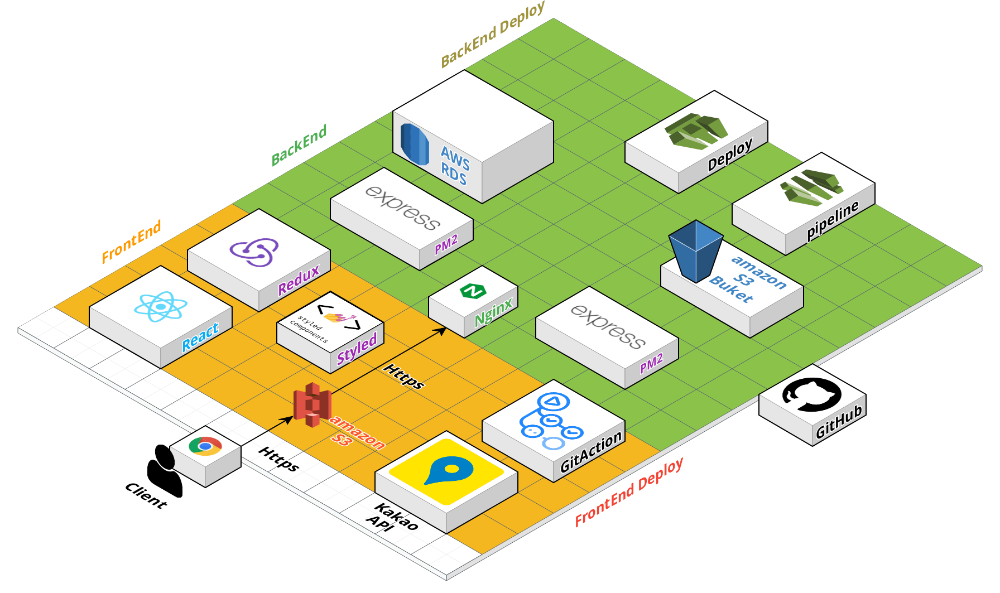

# 🌈 InSplace-BE

## ✍🏻 서비스 소개

InSplace는 In Seoul Place의 약자로,
내/외국인에게 당장 오늘 뭐 할지, 어디 갈지에 대한 고민을 현재 위치와 날씨를 기반으로 장소를 추천해주는 서비스입니다.

## ⛅️ 팀원 소개

- **Back End**
  - 나종완(팀장)([https://github.com/jongwanra](https://github.com/jongwanra))
  - 이병관([https://github.com/fnrkp089](https://github.com/fnrkp089))
  - 김기태([https://github.com/TAE6919](https://github.com/TAE6919))
- **Front End**
  - 양진성([https://github.com/jinseoIT](https://github.com/jinseoIT))
  - 이미다([https://github.com/dam-lee](https://github.com/dam-lee))
  - 고규식([https://github.com/kokyusik91](https://github.com/kokyusik91))
- **Designer**
  - 이미주([]())
  - 이경미([https://github.com/leekyungmimiii](https://github.com/leekyungmimiii))

## 기술 스택


## ❄️ Architecture



## 🔎 API

[Notion API Address](https://humble-impulse-a58.notion.site/API-ea80617bb56e4488807877a15ad2a3c2)


## 📋 ERD


## 🌧 Library

```json
"dependencies": {
    "@slack/webhook": "^6.0.0",
    "app-root-path": "^3.0.0",
    "aws-sdk": "^2.1013.0",
    "axios": "^0.24.0",
    "bcrypt": "^5.0.1",
    "compression": "^1.7.4",
    "connect-redis": "^6.0.0",
    "cors": "^2.8.5",
    "date-utils": "^1.2.21",
    "debug": "~2.6.9",
    "dotenv": "^10.0.0",
    "ejs": "~2.6.1",
    "express": "~4.16.1",
    "joi": "^17.4.2",
    "jsonwebtoken": "^8.5.1",
    "morgan": "~1.9.1",
    "multer": "^1.4.3",
    "multer-s3": "^2.10.0",
    "multer-s3-transform": "^2.3.2",
    "mysql2": "^2.3.2",
    "node-cron": "^3.0.0",
    "node-schedule": "^2.0.0",
    "qs": "^6.10.1",
    "redis": "^3.1.2",
    "sharp": "^0.29.2",
    "swagger-jsdoc": "^6.1.0",
    "swagger-ui-express": "^4.1.6",
    "winston-daily-rotate-file": "^4.5.5"
  },
  "devDependencies": {
    "artillery": "^1.7.9",
    "jest": "^27.3.1",
    "supertest": "^6.1.6",
    "winston": "^3.3.3"
  }
```
## Trouble Shooting
- 

